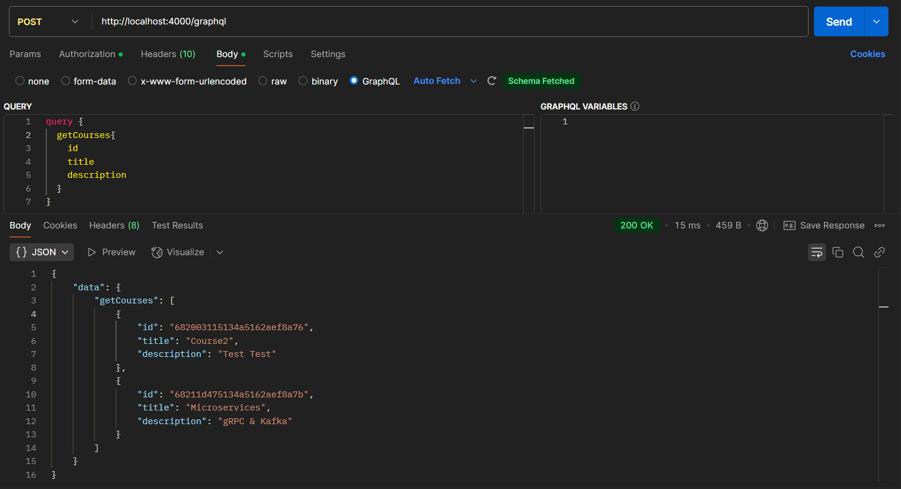
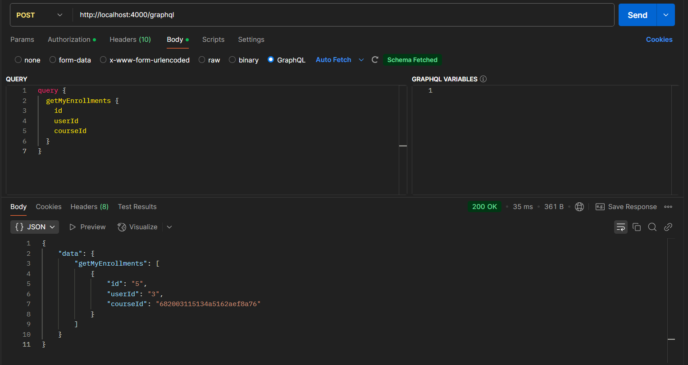

# EduTrack – Mini projet SOA

## Sommaire
1. [Présentation du projet](#présentation-du-projet)
2. [Architecture microservices détaillée](#architecture-microservices-détaillée)
3. [Description des services](#description-des-services)
4. [Flux d'inscription à un cours (détail)](#flux-dinscription-à-un-cours-détail)
5. [Schémas de données et protocoles](#schémas-de-données-et-protocoles)
6. [Conception](#Conception)
7. [Sécurité et gestion des accès](#sécurité-et-gestion-des-accès)
8. [Technologies et outils](#technologies-et-outils)
9. [Exemples d'exécution via Postman](#exemples-dexécution-via-postman)

---

## Présentation du projet

EduTrack est un mini projet dévolppé pour l'examen final de la matière SOA. Elle est une plateforme de gestion de cours en ligne, conçue selon une architecture microservices. Elle permet :
- L'inscription et l'authentification des utilisateurs
- La gestion des cours
- L'inscription des utilisateurs aux cours
- La notification des services via des événements asynchrones (Kafka)

---

## Architecture microservices détaillée


---

## Description des services

### API Gateway
- Point d'entrée unique (REST pour l'auth, GraphQL pour le reste)
- Authentification JWT
- Redirige les requêtes vers les microservices via gRPC
- Expose les mutations et queries GraphQL

### User Service
- Gestion des utilisateurs (inscription, connexion)
- Stockage des utilisateurs dans une base MySQL
- Hashage des mots de passe avec bcrypt
- Génération et validation de JWT

### Cours Service
- Ajout, liste, détail des cours
- Stockage MongoDB
- Consommation des événements Kafka pour réagir aux inscriptions (user-enrolled)

### Inscription Service
- Gestion des inscriptions des utilisateurs aux cours
- Stockage des inscriptions dans PostgreSQL
- Publication d'événements Kafka lors d'une nouvelle inscription

---

## Flux d'inscription à un cours (détail)


---

## Schémas de données et protocoles

### Protobuf – User
```protobuf
syntax = "proto3";
package user;
service UserService {
  rpc Register (RegisterRequest) returns (RegisterResponse);
  rpc Login (LoginRequest) returns (LoginResponse);
}
message RegisterRequest { string email = 1; string password = 2; }
message RegisterResponse { string message = 1; }
message LoginRequest { string email = 1; string password = 2; }
message LoginResponse { string token = 1; }
```

### Protobuf – Cours
```protobuf
syntax = "proto3";
package course;
service CourseService {
  rpc AddCourse (CourseInput) returns (Course);
  rpc ListCourses (Empty) returns (CourseList);
  rpc GetCourse (CourseRequest) returns (Course); 
}
message CourseInput { string title = 1; string description = 2; }
message Course { string id = 1; string title = 2; string description = 3; }
message CourseList { repeated Course courses = 1; }
```

### Protobuf – Inscription
```protobuf
syntax = "proto3";
package enrollment;
service EnrollmentService {
  rpc Enroll (EnrollRequest) returns (EnrollResponse);
  rpc ListEnrollments (UserRequest) returns (EnrollmentList);
}
message EnrollRequest { int32 userId = 1; string courseId = 2; }
message EnrollResponse { string message = 1; }
message Enrollment { int32 id = 1; int32 userId = 2; string courseId = 3; }
message EnrollmentList { repeated Enrollment enrollments = 1; }
```

## Schémas de données

### Utilisateur (MySQL)
| Champ      | Type    |
|------------|---------|
| id         | INT     |
| email      | VARCHAR |
| password   | VARCHAR |

### Cours (MongoDB)
| Champ        | Type    |
|--------------|---------|
| _id          | ObjectId|
| title        | String  |
| description  | String  |

### Inscription (PostgreSQL)
| Champ      | Type    |
|------------|---------|
| id         | SERIAL  |
| user_id    | INT     |
| cours_id   | VARCHAR |

---

### Modèle relationnel


---

## Conception

### Vue d'ensemble des interactions


### Détail Kafka Event


---

## Sécurité et gestion des accès
- Authentification JWT (généré par User Service, vérifié par API Gateway)
- Middleware d'authentification sur les routes sensibles
- Les tokens sont transmis dans l'en-tête Authorization

---

## Technologies et outils
- **Node.js** (Express, Apollo Server)
- **gRPC** (communication interservices)
- **Kafka** (asynchrone, event-driven)
- **MySQL** (utilisateurs)
- **MongoDB** (cours)
- **PostgreSQL** (inscriptions)

---

## Exemples de requêtes GraphQL
```graphql
mutation { register(email: "test@example.com", password: "123456") }
mutation { login(email: "test@example.com", password: "123456") }
mutation { addCourse(title: "Mathématiques", description: "Cours de base") }
mutation { enrollInCourse(courseId: "123") }
query { getMyEnrollments { id courseId } }
```

---

## Exemples d'exécution via Postman

### 1. Inscription d'un utilisateur


- **Méthode :** POST `/auth/register`
- **Corps :**
  ```json
  {
    "email": "test@mail.com",
    "password": "1234"
  }
  ```
- **Réponse attendue :**
  ```json
  {
    "message": "User registered successfully"
  }
  ```

### 2. Connexion d'un utilisateur


- **Méthode :** POST `/auth/login`
- **Corps :**
  ```json
  {
    "email": "test@example.com",
    "password": "123456"
  }
  ```
- **Réponse attendue :**
  ```json
  {
    "token": "<jwt_token>"
  }
  ```

### 3. Ajout d'un cours


- **Méthode :** Mutation GraphQL `addCourse`
- **Corps :**
  ```graphql
  mutation {
    addCourse(title: "Microservices", description: "gRPC & Kafka") {
      id
      title
      description
    }
  }
  ```
- **Réponse attendue :**
  ```json
  {
    "data": {
        "addCourse": {
            "id": "68211d475134a5162aef8a7b",
            "title": "Microservices",
            "description": "gRPC & Kafka"
        }
    }
  }
  ```
### 4. Récupération d'un cours avec l'Id


- **Méthode :** query GraphQL `getCourse`
- **Corps :**
  ```graphql
  query {
    getCourse(id: "681fe09aaaea9968314d43af") {
      id
      title
      description
    }
  }
  ```
- **Réponse attendue :**
  ```json
  {
      "data": {
          "getCourse": {
              "id": "681fe09aaaea9968314d43af",
              "title": "Microservices",
              "description": "gRPC & Kafka"
          }
      }
  }
  ```
### 5. Récupération des cours



- **Méthode :** query GraphQL `getCourses`
- **Corps :**
  ```graphql
  query {
    getCourses{
      id
      title
      description
    }
  }
  ```
- **Réponse attendue :**
  ```json
  {
      "data": {
          "getCourses": [
              {
                  "id": "682003115134a5162aef8a76",
                  "title": "Course2",
                  "description": "Test Test"
              },
              {
                  "id": "68211d475134a5162aef8a7b",
                  "title": "Microservices",
                  "description": "gRPC & Kafka"
              }
          ]
      }
  }
  ```

### 6. Inscription à un cours


- **Méthode :** Mutation GraphQL `enrollInCourse`
- **Corps :**
  ```graphql
  mutation {
    enrollInCourse(courseId: "682003115134a5162aef8a76")
  }

  ```
- **Réponse attendue :**
  ```json
  {
    "data": {
      "enrollInCourse": "Enrollment successful"
    }
  }
  ```

### 7. Récupérer les inscriptions de l'utilisateur



- **Méthode :** Query GraphQL `getMyEnrollments`
- **Corps :**
  ```graphql
  query {
    getMyEnrollments {
      id
      courseId
    }
  }
  ```
- **Réponse attendue :**
  ```json
  {
      "data": {
          "getMyEnrollments": [
              {
                  "id": "5",
                  "userId": "3",
                  "courseId": "682003115134a5162aef8a76"
              }
          ]
      }
  }
  ```
---

## Auteur

- **Mohamed Riadh Essridi**
- Classe : 4GL1
